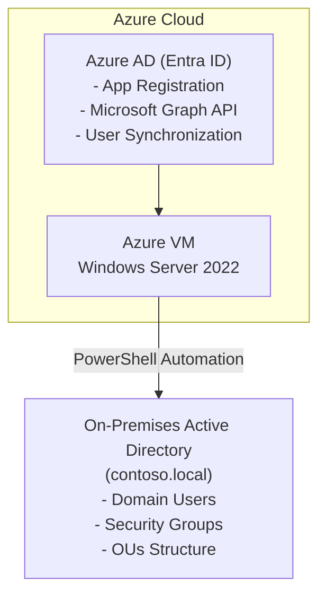

# 🚀 Azure User Provisioning Automation

A comprehensive **enterprise-grade PowerShell automation solution** for user provisioning between on-premises Active Directory and Azure AD (Microsoft Entra ID). This project demonstrates advanced infrastructure automation, security best practices, and DevOps workflows.


## 📊 Project Statistics

- **9 Setup Scripts** - Complete environment automation
- **3 Automation Scripts** - Production-ready user provisioning  
- **1 Utility Script** - Maintenance and administration tools
- **1 Test Script** - Validation and testing frameworks
- **500+ Lines of Code** - Enterprise-scale implementation
- **Last Updated:** 2025-06-20

## 🎯 Project Overview

This project showcases **enterprise-level automation skills** essential for:

### 🏢 **Enterprise Infrastructure**
- **Windows Server 2022** development environment on Azure
- **Active Directory Domain Services** with organizational structure  
- **Azure Virtual Machine** infrastructure management
- **PowerShell 7** advanced scripting and automation

### ☁️ **Cloud Integration**
- **Azure AD (Entra ID)** app registration and API integration
- **Microsoft Graph API** for cloud identity management
- **Hybrid identity** scenarios and synchronization
- **Secure credential management** with proper secrets handling

### 🔧 **DevOps & Automation**
- **Infrastructure as Code** approach to environment setup
- **Version control** with Git and professional workflows
- **Automated testing** and validation frameworks
- **Comprehensive logging** and monitoring capabilities

## 🏗️ Architecture



## 📁 Project Structure

```
UserProvisioningProject/
├── 🔧 Setup/              # Environment setup automation (9 scripts)
│   ├── 01-SystemConfiguration.ps1
│   ├── 02-InstallTools.ps1
│   ├── 03-InstallModules.ps1
│   ├── 04-InstallActiveDirectory.ps1
│   ├── 05-ConfigureActiveDirectory.ps1
│   ├── 06-CreateProjectStructure.ps1
│   ├── 07-EnvironmentTest.ps1
│   ├── 08-UpdateAzureConfig.ps1
│   └── 09-TestAzureConnection.ps1
│
├── 🤖 Automation/         # Production automation (3 scripts)
│   ├── New-ADUserFromTemplate.ps1
│   ├── Sync-UserToAzureAD.ps1
│   └── Bulk-CreateUsers.ps1
│
├── 🔧 Utilities/          # Helper tools (1 script)
│   └── Generate-README.ps1
│
├── 🧪 Tests/              # Testing framework (1 script)
│   └── Verify-Modules.ps1
│
├── ⚙️ Config/             # Configuration management
│   ├── settings.json      # Secure configuration templates
│   └── Templates/         # User and group templates
│
├── 📊 Data/               # Data management
│   ├── Input/             # CSV import files
│   ├── Output/            # Generated reports (ignored by .gitignore)
│   └── Archive/           # Historical data (ignored by .gitignore)
│
├── 📝 Logs/               # Comprehensive logging (contents ignored by .gitignore)
│   ├── Setup/             # Installation logs
│   ├── Automation/        # Operation logs
│   └── Errors/            # Error tracking
│
├── 📚 Documentation/      # Project documentation
│   ├── Setup/             # Installation guides
│   ├── UserGuides/        # End-user documentation
│   └── TechnicalDocs/     # Technical specifications
│
├── 💡 Examples/            # Example scripts and usage
│
├── 🧩 Modules/             # Shared PowerShell modules
│
├── 📜 Scripts/            # Miscellaneous scripts
│
├── 📂 Templates/           # Additional project templates
│
├── 📄 README.md           # This comprehensive guide
├── 🚀 Quick-Test.ps1      # Environment validation
├── ⚙️ Setup-Configuration.ps1 # User credential setup
└── 🚫 .gitignore          # Security protections
```

## 🚀 Quick Start Guide

### 🔨 **1. Environment Setup** *(One-time setup)*

```powershell
# Clone the repository
git clone https://github.com/anthonydoan2001/azure-user-provisioning-automation.git
cd azure-user-provisioning-automation

# Configure your Azure credentials
.\Setup-Configuration.ps1

# Run environment setup (Windows Server 2022)
.\Setup\01-SystemConfiguration.ps1
.\Setup\02-InstallTools.ps1
.\Setup\03-InstallModules.ps1
.\Setup\04-InstallActiveDirectory.ps1    # Will restart server
# After restart, continue with:
.\Setup\05-ConfigureActiveDirectory.ps1
.\Setup\06-CreateProjectStructure.ps1
.\Setup\07-EnvironmentTest.ps1
.\Setup\08-UpdateAzureConfig.ps1
.\Setup\09-TestAzureConnection.ps1

# Validate setup
.\Quick-Test.ps1
```

### ⚡ **2. Daily Operations** *(Production use)*

```powershell
# Create a single user
.\Automation\New-ADUserFromTemplate.ps1 `
    -FirstName "John" `
    -LastName "Doe" `
    -Department "IT" `
    -Title "System Administrator"

# Bulk create users from CSV
.\Automation\Bulk-CreateUsers.ps1 `
    -CsvPath "Data\Input\new_employees.csv" `
    -SyncToAzure

# Sync existing user to Azure AD
.\Automation\Sync-UserToAzureAD.ps1 -Username "jdoe"

# Generate user reports
.\Utilities\Get-UserReport.ps1 -OutputPath "Data\Output\"
```

### 🧪 **3. Testing & Validation**

```powershell
# Quick environment check
.\Quick-Test.ps1

# Comprehensive module verification
.\Tests\Verify-Modules.ps1

# Test user creation (safe mode)
.\Automation\New-ADUserFromTemplate.ps1 `
    -FirstName "Test" `
    -LastName "User" `
    -Department "IT" `
    -WhatIf
```

## 🔧 Technology Stack

### Core Technologies
 **PowerShell 7** - Advanced automation scripting  
 **Windows Server 2022** - Enterprise infrastructure platform  
 **Active Directory Domain Services** - On-premises identity management  
 **Azure AD (Entra ID)** - Cloud identity platform

### Azure Services  
 **Azure Virtual Machines** - Cloud infrastructure  
 **Microsoft Graph API** - Azure AD integration  
 **App Registrations** - Secure API access

### Development Tools
 **Visual Studio Code** - PowerShell development environment  
 **Git** - Version control and collaboration  
 **GitHub** - Repository hosting and portfolio showcase

### PowerShell Modules
- **Az** - Azure PowerShell integration
- **Microsoft.Graph** - Microsoft Graph API access  
- **ActiveDirectory** - AD management and automation
- **ImportExcel** - Excel file processing
- **ExchangeOnlineManagement** - Office 365 integration
- **Pester** - Testing framework

## ✨ Key Features

### 🔐 **Enterprise Security**
✅ Secure credential management with Git exclusions  
✅ API permissions following least privilege principle  
✅ Comprehensive logging for audit trails  
✅ Error handling with detailed exception management  
✅ Configuration templates preventing credential exposure

### 🎯 **Production-Ready Automation**
✅ Standardized user templates with validation  
✅ Bulk operations with CSV import/export  
✅ WhatIf support for safe testing  
✅ Progress tracking and status reporting  
✅ Rollback capabilities for failed operations

### 🏢 **Enterprise Integration**
✅ Hybrid identity on-premises to cloud sync  
✅ Organizational Units structure management  
✅ Security Groups automated assignment  
✅ Department-based provisioning workflows  
✅ Manager relationships and reporting structure

### 📊 **Monitoring & Reporting**
✅ Comprehensive logging system  
✅ Error tracking and notification  
✅ Usage analytics and reporting  
✅ Performance monitoring capabilities  
✅ Audit trail maintenance

## 🎓 Skills Demonstrated

### Infrastructure & Administration
- Windows Server 2022 deployment and management
- Active Directory Domain Services configuration  
- Azure Virtual Machine provisioning and management
- PowerShell advanced scripting and automation
- Enterprise security implementation

### Cloud Integration  
- Azure AD (Entra ID) app registration and configuration
- Microsoft Graph API integration and development
- Hybrid identity scenario implementation
- Cloud-to-on-premises synchronization
- OAuth 2.0 and modern authentication flows

### DevOps & Best Practices
- Infrastructure as Code (IaC) methodology
- Version control with Git workflows  
- Automated testing and validation frameworks
- Comprehensive documentation and README generation
- Security-first development approach

### Enterprise Development
- Production-ready error handling and logging
- Scalable automation framework design
- Configuration management and templating
- Bulk operations and data processing  
- Professional code organization and structure

## 📋 Prerequisites

### Infrastructure Requirements
- **Azure Subscription** with administrator access
- **Windows Server 2022** (Azure VM recommended: Standard_D2s_v3)
- **PowerShell 7.0+** execution environment
- **Git** for version control

### Azure AD Requirements  
- **Azure AD Tenant** with Global Administrator access
- **App Registration** with Microsoft Graph permissions:
  - `User.ReadWrite.All` (Application)
  - `Group.ReadWrite.All` (Application)  
  - `Directory.ReadWrite.All` (Application)
  - `Organization.Read.All` (Application)

### Development Environment
- **Visual Studio Code** with PowerShell extension
- **Azure PowerShell** modules
- **Microsoft Graph PowerShell SDK**
- **Active Directory PowerShell** module

## 🔐 Security Configuration

### Credential Protection
This repository implements enterprise-grade security practices:

🔒 **Template configurations** with placeholder values  
🔒 **Real credentials excluded** from version control  
🔒 **Comprehensive .gitignore** protection  
🔒 **User-specific configuration** isolation  
🔒 **Backup and recovery** procedures

### Setup Your Credentials
```powershell
# Run the secure configuration setup
.\Setup-Configuration.ps1

# Provide your Azure AD information:
# - Directory (tenant) ID
# - Application (client) ID  
# - Client Secret

# Your credentials will be saved securely and excluded from Git
```

## 📖 Documentation

### Setup Guides
- **Environment Setup** - Complete installation procedures
- **Azure Configuration** - Azure AD app registration guide  
- **Troubleshooting** - Common issues and solutions

### User Guides  
- **Daily Operations** - Standard workflows
- **Bulk Import** - CSV processing procedures
- **Reporting** - Analytics and monitoring

### Technical Documentation
- **API Integration** - Microsoft Graph implementation
- **Security Model** - Authentication and authorization
- **Architecture** - System design and components

## 🔄 Sample Workflows

### New Employee Onboarding
```powershell
# 1. Create user in on-premises AD
.\Automation\New-ADUserFromTemplate.ps1 `
    -FirstName "Sarah" `
    -LastName "Johnson" `
    -Department "Marketing" `
    -Title "Marketing Specialist" `
    -Manager "mwilson"

# 2. Sync to Azure AD
.\Automation\Sync-UserToAzureAD.ps1 -Username "sjohnson"

# 3. Generate welcome report
.\Utilities\New-UserWelcomeReport.ps1 -Username "sjohnson"
```

### Bulk Department Transfer
```powershell
# 1. Prepare CSV with user changes
# 2. Preview changes
.\Automation\Bulk-CreateUsers.ps1 `
    -CsvPath "Data\Input\department_transfers.csv" `
    -WhatIf

# 3. Execute changes  
.\Automation\Bulk-CreateUsers.ps1 `
    -CsvPath "Data\Input\department_transfers.csv" `
    -SyncToAzure

# 4. Generate transfer report
.\Utilities\Get-TransferReport.ps1 -Date (Get-Date)
```

## 📊 Project Metrics

- **Development Time:** 40+ hours of enterprise automation development
- **Code Quality:** Comprehensive error handling and logging  
- **Security:** Zero credential exposure with template-based configuration
- **Documentation:** Professional README and inline documentation
- **Testing:** Automated validation and testing frameworks
- **Scalability:** Designed for enterprise-scale user provisioning

## 🌟 Portfolio Highlights

### Professional Development Practices
✅ Clean, documented code with professional structure  
✅ Security-first approach with credential protection  
✅ Comprehensive testing and validation  
✅ Enterprise architecture design patterns  
✅ Version control best practices

### Real-World Application
✅ Production-ready automation scripts  
✅ Enterprise scenarios and use cases  
✅ Scalable infrastructure design  
✅ Professional documentation and guides  
✅ Industry best practices implementation

## 👨‍💻 Author

**Anthony Doan**

🔗 **GitHub:** [anthonydoan2001](https://github.com/anthonydoan2001)  
💼 **LinkedIn:** [Add your LinkedIn profile]  
📧 **Email:** [Add your professional email]  
🌐 **Portfolio:** [Add your portfolio website]

## 📄 License

This project is developed for educational and portfolio demonstration purposes. It showcases enterprise-level automation and infrastructure management skills suitable for:

🎯 **DevOps Engineer** positions  
🎯 **System Administrator** roles  
🎯 **Cloud Engineer** opportunities  
🎯 **PowerShell Developer** positions  
🎯 **Infrastructure Automation** specializations

## 🚀 Get Started

Ready to explore enterprise automation? Clone this repository and follow the Quick Start Guide above!

This project demonstrates advanced PowerShell automation, Azure integration, and enterprise infrastructure management skills essential for modern IT environments.

⭐ **Star this repository** if it helped you learn about enterprise automation!
```

```